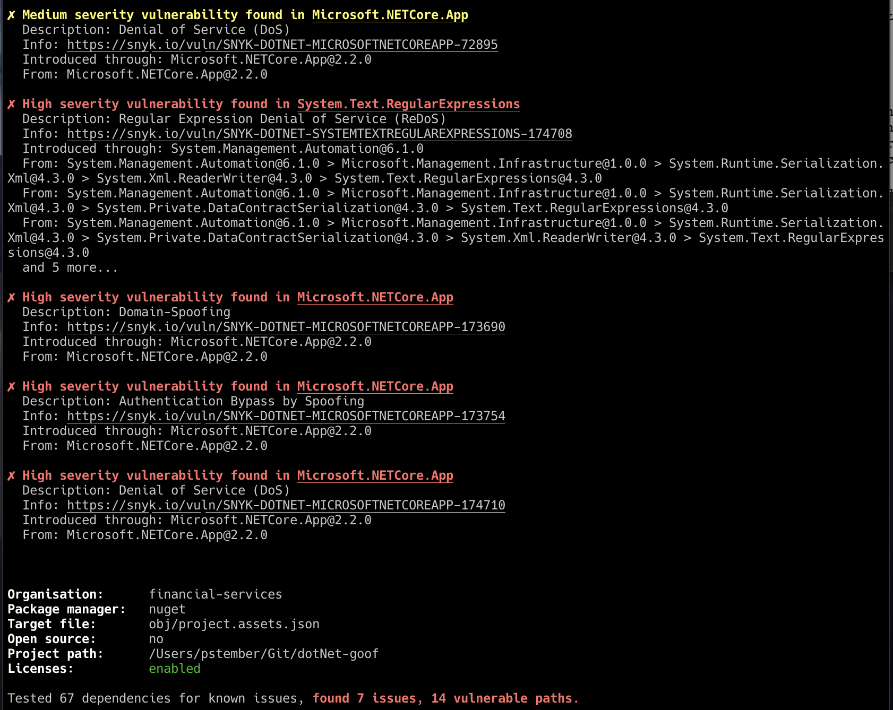

# .Net Goof

1. Open a terminal and clone the repository

   ```console
   git clone git@github.com:pstember/dotNet-goof.git
   ```

Open a terminal and open the `dotNet-goof` directory.

2. Build the project

   ```console
   dotnet build
   ```

3. Test the project

   ```console
   snyk test
   ```

All-in-one to clone and run:

```console
git clone git@github.com:pstember/dotNet-goof.git && \
cd dotNet-goof && \
dotnet build && \
snyk test
```

## Screenshots

The following screenshot demonstrates the extra value provided when scanning a
project using the Snyk CLI tool

### Vulnerability detection

This screenshot shows vulnerabilities and potential remediation when such remediation exist


